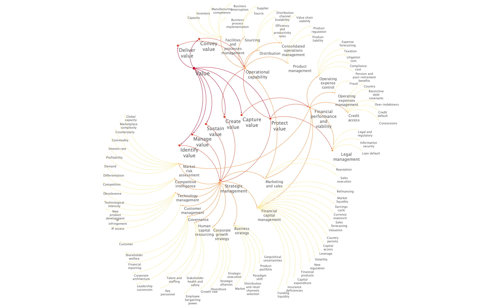
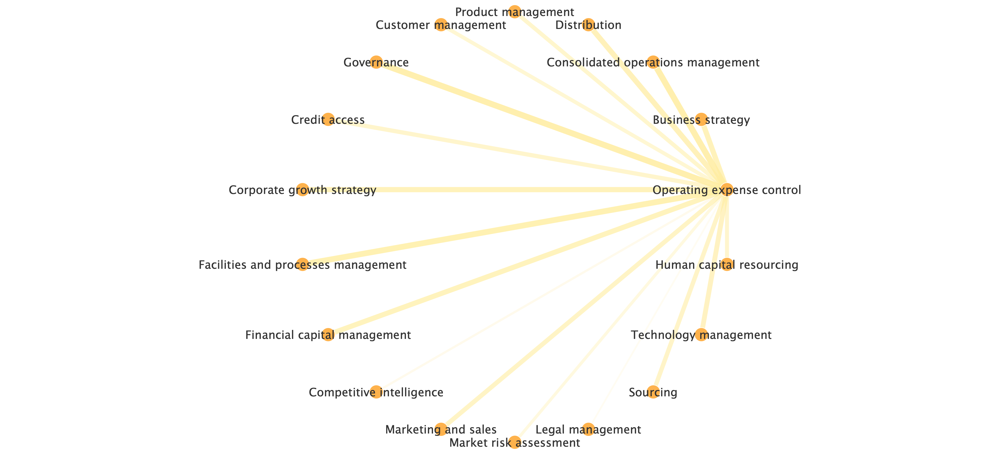
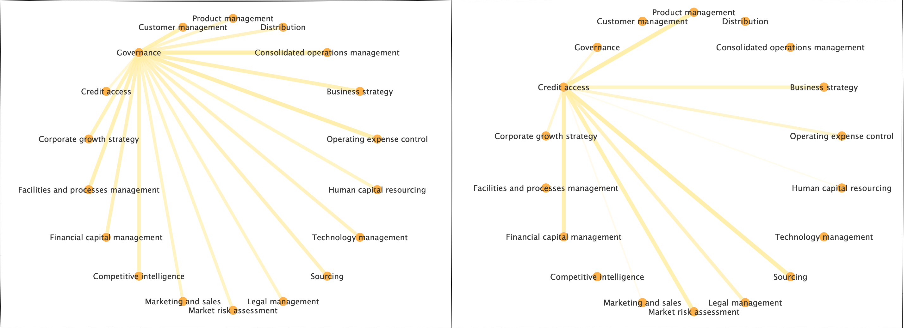
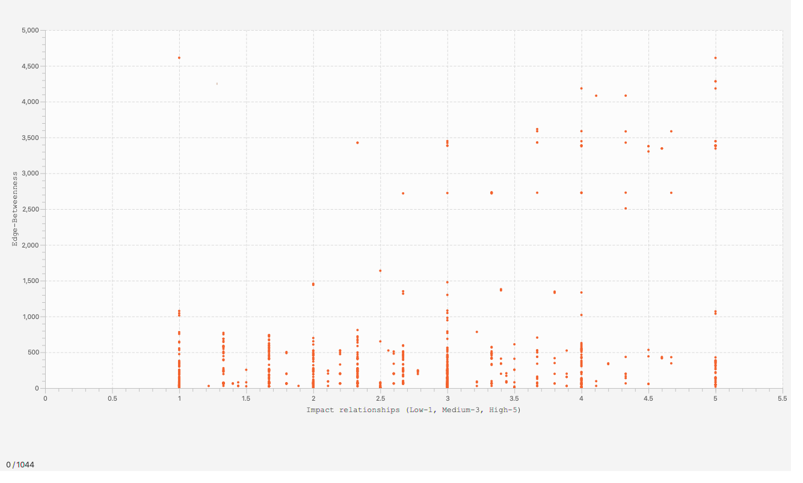

**Disclaimer\:** This Project Outcomes Report for the General Public is displayed verbatim as submitted by the Principle Investigator (PI) for this award. Any opinions, findings, and conclusions or recommendations expressed in this Report are those of the PI and do not necessarily reflect the views of the National Science Foundation; NSF has not approved or endorsed its content.

**Award Title\:** Doctoral Dissertation Research in DRMS: Building a comprehensive understanding of enterprise risks and their interdependencies for improved risk-intelligence

**Federal Award ID\:** 2049782

**Report Submission Period\:** 01/01/2021 to 12/31/2021

This project addressed a major gap in risk management by developing a robust inventory of the risk factors that may affect an enterprise and an understanding of the complex interdependencies between them.  This insight is foundational to build enterprise risk intelligence to foresee, and thus plan and prepare for, cascading effects caused by seemingly unrelated events.  A scientifically rigorous and data-driven approach to building risk intelligence is one of the cornerstones of creating resilient enterprises, which is critical to advancing national prosperity and welfare, thereby aligning with NSF mission. The project was carried out in 3 phases with related descriptions and outcomes as follows:

In phase 1, a comprehensive enterprise-agnostic inventory of risk factors was developed through automated information extraction from a corpus of hundreds of thousands of public and private documents describing risks to businesses of U.S. S&P 500 corporations.  The risk factor inventory is hosted on the Purdue University Research Repository (PURR) [project](https://purr.purdue.edu/projects/nsfriskintelligence/) and appended to the co-PI's doctoral dissertation ([Sheth AB, 2021](https://doi.org/10.25394/PGS.15062880.v1)).

In phase 2, the extracted risk factors were organized into a typology of enterprise risks via thematic analysis.  The outcome is an organized enterprise risk typology that can be readily queried by both researchers and practitioners alike to build awareness of risk forms and identify potentially significant risk linkages.  The typology has 5 levels, with level-5 being the broadest and containing 800+ risk factors grouped into 76 level-4 risk categories.  Risk categories belong to 18 level-3 business functions housed under 4 key business areas at level-2, which themselves are organized based on core value functions of an enterprise at level-1.  [Figure 1](#fig-1) below represents the first 4 levels of the enterprise risk typology.  It is the first such typology of this scale available to the field.

|  |
|:--:|
|<b> Figure 1 - Enterprise risk typology levels 1 through 4 </b>   This image displays Level 1 to 4 of the enterprise risk typology developed as part of the NSF DDRIG award # 2049782. (Level 5 contains 800+ risk factors and can be found on the PURR database) | 

In phase 3, the risk typology was converted into multiple complex quantified risk networks (QRNs).  Expert input was utilized to develop an understanding of inter-risk relationships.  A fully anonymous interactive survey was developed using the Qualtrics platform and circulated among academic experts and business leaders.  Knowledge of interactions between business functions (3-3) and between risk categories and business functions (4-3) was solicited from 60 experts with deep risk knowledge, operational experience, decision-making authority, or board membership in large established firms.  Responses covered 10 economic sectors and 26 industries.  A total of 18 risk networks were developed and are hosted on PURR for researchers and practitioners.  An example of inter-function interactions is shown in Figure 2.

|  |
|:--:|
|<b> Figure 2 - Level 3-3 Risk Interactions </b>   Illustration of inter-function links (level 3-3). Edges represent impact between functions. Width of edges correlates to impact strength. Wider edges imply more significant relationship (with Governance), and thinner edges imply less significant relationship (with Competitive Intelligence) |

Importantly, the networks highlight that some business functions such as 'Governance' uniformly affect all other functions.  However, their impact may not be uniformly consequential across functions in comparison to others such as 'Credit access', which has fewer but more consequential impacts, for example, on 'Financial capital management' or on 'Sourcing' as shown in Figure 3.  A complete comparison is provided on the PURR repository.

||
|:--:|
|<b> Figure 3 - Level 3-3 Inter-function interactions </b>   Comparison of level 3-3 interactions. Governance (left) connects uniformly to all other business functions, whereas Credit access (right) does not impact similarly. The impact of Credit access on certain functions (Product management) is stronger than that of Governance |

Beyond inter-function relationships, expert input helped quantify the relationships between risk categories and business functions, i.e., level 4-3.  A resulting network with 75 nodes and 1044 weighted interlinks clearly indicates the complexity of enterprise risk management.  Figure 4 reveals that despite the large array of functions and risk categories, a smaller number are particularly high impact, as indicated by a measure of their role in connecting other risks in the network, known as 'Betweenness Centrality'.  

||
|:--:|
|<b> Figure 4 - Linkages between Level 4 risks and level 3 functions </b>   Edge width directly correlates with Edge-Betweenness such that greater width implies connection between two dense clusters. Purple links imply a high impact relationship between the risk factor and the business function, blue imply a medium impact, and yellow imply low impact |

Figure 5 relates 'Edge-Betweenness', which is an indicator of the presence of dense sub-network clusters within the larger network, to the 'Impact relationship' of the network, which is a quantitative measure of how much a risk category affects a function.  The figure shows edges with high 'Betweenness' with both high and low impact relationships, thereby confirming the existence of dense clusters with critical links. 

||
|:--:|
|<b> Figure 5 - Risk Impact Evaluation (Edge-Betweenness vs. Impact)) </b>   This figure helps to identify particularly influential QRN relationships. Points in the top right corner are characterized by high-impact relationships with high levels of Edge-Betweenness. These edges are highly central to the risk and stability of the network |

For example, the 'Product management' function and 'Product regulation' and 'Product liability' risk categories share edges that have high 'Betweeness' implying their relevance to several other risk interrelationships.  However, and importantly, 'Product liability' risks have low impact on the function overall, whereas 'Product regulation' risks have a high impact.  Therefore, while both are crucial risk mitigation areas to limit negative effects from cascading across the enterprise, 'regulation' warrants much more attention of practitioners and researchers seeking the goal of enterprise resiliency.

The QRNs developed via this grant are resources to be further investigated to reveal insights on central and critical risks, sub-group structures in the risk network that could inform an order of risk criticality, and the cascade potential of risk events. 

Overall, the research conducted via this grant contributed to the field of Enterprise Risk Management (ERM) by increasing scholarly awareness on the breadth and interconnectedness of risks affecting enterprises, and by systematically converting erstwhile obscure standalone risk factors into QRNs.

{}
Click the *Cite* button above to import publication metadata into their reference management software.
{}

